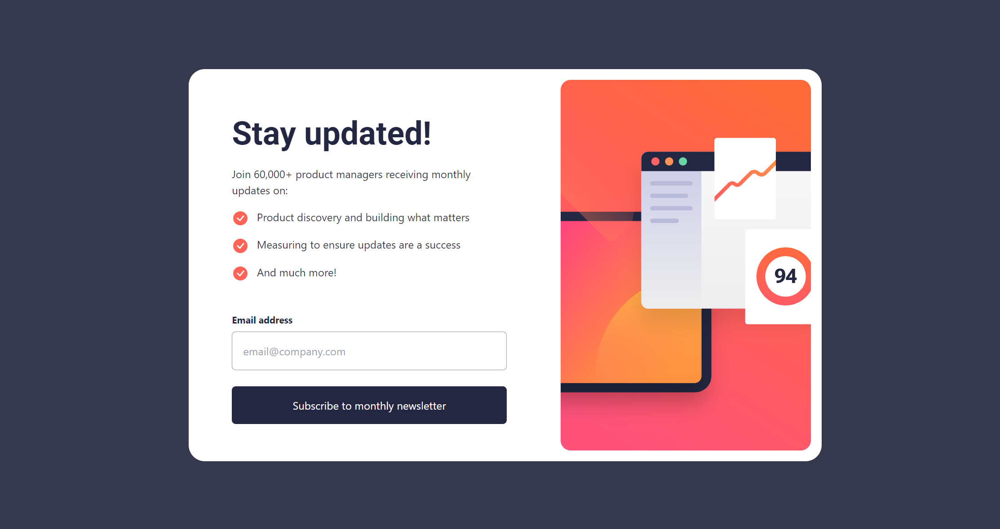

# Frontend Mentor - Newsletter sign-up form with success message solution

This is a solution to the [Newsletter sign-up form with success message challenge on Frontend Mentor](https://www.frontendmentor.io/challenges/newsletter-signup-form-with-success-message-3FC1AZbNrv). Frontend Mentor challenges help you improve your coding skills by building realistic projects.

## Table of contents

- [Overview](#overview)
  - [The challenge](#the-challenge)
  - [Screenshot](#screenshot)
  - [Links](#links)
- [My process](#my-process)
  - [Built with](#built-with)
  - [What I learned](#what-i-learned)
  - [Continued development](#continued-development)
  - [Useful resources](#useful-resources)
- [Author](#author)

## Overview

### The challenge

Users should be able to:

- Add their email and submit the form
- See a success message with their email after successfully submitting the form
- See form validation messages if:
  - The field is left empty
  - The email address is not formatted correctly
- View the optimal layout for the interface depending on their device's screen size
- See hover and focus states for all interactive elements on the page

### Screenshot



### Links

- Solution URL: [Add solution URL here](https://your-solution-url.com)
- Live Site URL: [Add live site URL here](https://your-live-site-url.com)

### Built with

- Semantic HTML5 markup
- Mobile-first workflow
- [React](https://reactjs.org/) - JS library
- [Tailwindcss](https://tailwindcss.com/) - For styles

### What I learned

I learnt how to handle url query strings in React and use it across different components as in the examples below:

```js
const handleSubmit = (e) => {
    e.preventDefault();
    console.log(formData);
    navigateTo(`/success?email=${encodeURIComponent(formData.email)}`);
  };

export default function Success() {
  const location = useLocation();
  const queryParams = new URLSearchParams(location.search);
  const email = queryParams.get("email");

  const navigateTo = useNavigate();

  const handleClick = () => {
    navigateTo("/");
  };

  return (...);
}

```

## Author

- Website - [Obiasor Gideon](https://drplain-portfolio.netlify.app/)
- Frontend Mentor - [@DrPlain](https://www.frontendmentor.io/profile/DrPlain)
- Twitter - [@obiasor](https://www.twitter.com/obiasor)
